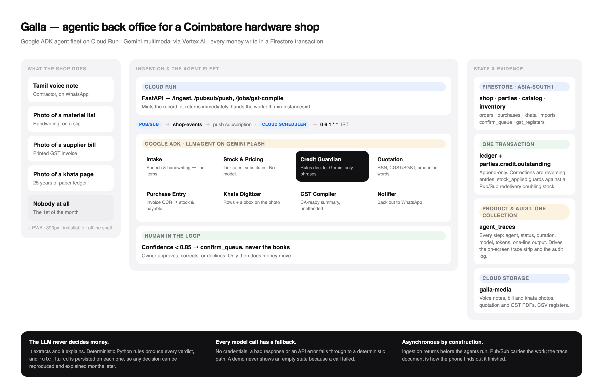

# Galla — Agentic Back Office for Indian Small Trade Shops

> **Hackathon:** All Things Agentic (Google/Devpost) · Track: **The Taskmaster**
> **Deadline: 31 Aug 2026, 5:00pm PT.**

**Tally needs a computer and an operator. Galla needs a phone camera and a thumb.**

A mobile-only PWA where a hardware-shop owner runs his entire back office by speaking,
photographing and tapping. Behind it, a fleet of Google ADK agents on Cloud Run does the
work asynchronously: parsing Tamil voice notes, reading handwritten material lists,
extracting supplier invoices, digitizing paper ledgers, **deciding on contractor credit**,
and compiling monthly GST summaries unattended.

**Live:** https://galla-tosijyjgva-el.a.run.app · `asia-south1`



---

## Run it in two minutes, with no Google Cloud account

The whole agent fleet runs locally against a JSON store and deterministic model
fallbacks, so you can see every screen before you spend a rupee of credits.

```bash
python3 -m venv .venv && .venv/bin/pip install -r backend/requirements.txt

cd backend
GALLA_STORE=local ../.venv/bin/python -m seed.seed_data      # demo shop, parties, catalog
GALLA_STORE=local ../.venv/bin/python -m uvicorn main:app --port 8080
```

In a second terminal (Node 20+):

```bash
cd frontend && npm install && npm run dev      # http://localhost:5173
```

Open the app, tap the **Demo** chip in the header, and send Selvam's voice note.
Watch the trace strip light up. Everything in `docs/demo-script.md` is reachable from
that sheet.

Run the tests — they assert the demo's actual numbers, so a change that breaks the
video breaks here first:

```bash
cd backend && GALLA_STORE=local ../.venv/bin/python -m pytest      # 55 tests
```

### What "local mode" does and does not fake

| | Local | Deployed |
|---|---|---|
| Agent chain, routing, tracing | real | real |
| Rules, verdicts, GST arithmetic, PDFs | real | real |
| Transactions, idempotence guards | real | real |
| Firestore | JSON files under `backend/.localdata` | Firestore, `asia-south1` |
| Pub/Sub | a worker thread | Pub/Sub push subscription |
| Gemini perception | fixture transcriptions in `backend/seed/fixtures/` | Gemini via Vertex AI |

`GALLA_STORE` is auto-detected: with application-default credentials present it uses
Firestore, otherwise it falls back to local. Nothing in `agents/` branches on it.

---

## Deploy to Google Cloud

```bash
cp .env.example .env               # fill in your project id
export GOOGLE_CLOUD_PROJECT=your-project
bash infra/deploy.sh               # APIs, Firestore, bucket, topic, service account, deploy,
                                   # push subscription, scheduler job, indexes
```

One Cloud Run service serves both the API and the built PWA — one origin, no CORS, one
thing to scale to zero. `deploy.sh` prints the follow-up commands for seeding, publishing
the Firestore rules, and firing the scheduler once so it has an execution in its history.

> The single-service arrangement is verified locally (`npm run build`, copy `dist` to
> `backend/web`, run uvicorn: API routes win, SPA routes fall through to the shell, path
> traversal is refused). The **container image itself has not been built** — no Docker
> daemon was available on the build machine — so budget a first `docker build .` before
> relying on `deploy.sh`.

Cost posture: `--min-instances=0`, Gemini **Flash** rather than Pro, and a short-TTL
in-process catalog cache instead of per-line Firestore queries.

---

## Read these to understand the build

1. `docs/PRD.md` — product spec, personas, all 7 features, screen list
2. `docs/firestore-schema.md` — the data model (**authoritative**)
3. `design/DESIGN-TOKENS.md` — visual spec (**authoritative** for styling)
4. `docs/demo-script.md` — the 4-minute video beats
5. `design/Galla Prototype v3.dc.html` — visual reference only; not built on

---

## The four decisions worth defending

**The LLM never decides money.** Gemini extracts and it explains. Every credit verdict
comes from deterministic rules in `agents/credit_guardian_agent.py::decide` — a pure
function with no I/O, unit-tested against all three outcomes — and `rule_fired` is
persisted on the verdict, so any decision can be reproduced and explained months later.
An LLM that *feels* a credit limit is a liability; one that explains a rule is an asset.

**Confidence gates the books.** Anything a model extracted carries a confidence. Below the
shop's threshold it goes to `confirm_queue` and waits for a human — never silently into
`ledger` or `inventory`. The khata digitizer puts a normalised bounding box on every row so
the owner can tap an entry and see the handwriting it came from. The paper khata earned his
trust by being inspectable; a digital entry that cannot be traced back to its ink is worth
less than the paper it replaced.

**Money moves only in transactions, and only once.** Ledger entry, party balance and
document status change together or not at all. `purchases.stock_applied` is read inside the
transaction, so a Pub/Sub redelivery cannot double-count a supplier bill. The ledger is
append-only; corrections are reversing entries.

**Every agent writes a trace, and every model call has a fallback.** `agent_traces` serves
the on-screen trace strip and the audit log from one collection. If credentials are absent
or a call fails, the agent falls through to a deterministic path — the demo never shows an
empty state because an API call failed.

---

## What is verified, and what is not

The demo path is exercised end to end on every commit, but two integrations can
only be *partly* proven without a Google Cloud project, so here is the honest split.

| Integration | State |
|---|---|
| Google ADK — `LlmAgent`, `Runner`, `InMemorySessionService`, multimodal `Content` | **Constructs and dispatches.** Driven to the live Gemini endpoint, which rejected only the API key — the request shape is accepted. The model's *response* has never been parsed against a real reply. |
| Gemini via Vertex AI | **Working in production.** Intake on `gemini-3.5-flash-lite`, Credit Guardian on `gemini-3.5-flash`, real token counts in `agent_traces`. |
| Firestore | **Working in production**, `asia-south1`. Also contract-tested against the real client offline (`tests/test_firestore_contract.py`). |
| Firestore transactions | Real semantics: `core/localstore.py` deliberately does **not** offer read-your-writes, because Firestore does not. That faithfulness caught a lost-stock bug on duplicated invoice lines. |
| Cloud Run · Pub/Sub · Cloud Scheduler · Cloud Storage | **Working in production.** Event in → push subscription → agent chain → verdict; Scheduler produced a GST register unattended; quotation PDF written to `gs://galla-media`. |
| Firestore rules | **Published** to `cloud.firestore`. |
| Owner authentication | **A shop passcode**, PBKDF2-hashed with a per-shop salt, HMAC-signed session tokens, rate-limited. Every `/api` route is gated. Firebase Auth on a phone number is the stronger successor. |
| Gemini vision | **Working in production.** A photographed GST invoice returns supplier, GSTIN, invoice number, every line, and the right tax slab per line. |

### Running a real shop on it

The deployed instance holds no seeded data. A fresh install shows a three-step
setup — shop details, tax details, passcode — and then an empty counter. The
catalogue and the contact list fill themselves in from the first bills and khata
pages photographed; nothing is invented on the owner's behalf.

Install it by opening the URL on a phone and choosing **Add to Home screen**
(Chrome on Android, Safari on iOS). It runs as a normal app from then on, and the
shell opens offline — though anything touching money is network-first, so the
owner never acts on a stale balance.

`POST /api/setup/erase` wipes every record back to first-run. It needs the
passcode *and* the word ERASE, because there is no undo.

### The one thing a judge will poke at

`infra/firestore.rules` restricts client access to an authenticated owner, but
**nothing authenticates**: the PWA sends no credentials, the API is deployed
`--allow-unauthenticated`, and the agents use the Admin SDK, which bypasses rules
entirely. So the rules are correct and currently unused, and the API is open.

`/pubsub/push` and `/jobs/gst-compile` could otherwise be used to inject a fake
sale or burn Gemini credits, so both verify the OIDC token Google signs them
with. `REQUIRE_OIDC=true` is **enabled on the deployed service** and both paths
were re-tested end to end afterwards: an unauthenticated call gets 403, while
Pub/Sub and Cloud Scheduler still get through.

The session secret lives in Secret Manager, not an environment variable.

Owner sign-in is a **passcode, not an identity system** — one owner, one shop,
one phone. It is the right shape for the user and vastly better than an open
ledger, but Firebase Auth on a phone number is the stronger successor and the
obvious next step.

## Repo layout

```
backend/
  main.py            /ingest · /pubsub/push · /jobs/gst-compile · serves the PWA
  agents/            one file per agent + router.py (chains them by event type)
  api/               reads.py · actions.py · demo.py
  core/              adk (the ADK bridge) · trace · transactions · catalog · stock
                     money · serialize · storage · localstore · config
  seed/              seed_data.py + fixtures/ (the demo's known-good perceptions)
  tests/             55 tests: credit rules, money, transactions, intake, full chain,
                     and a real-Firestore API contract suite
frontend/            React + Vite + Tailwind PWA, 390px mobile-first
infra/               deploy.sh · firestore.indexes.json · firestore.rules
firebase.json        points the Firebase CLI at the rules and indexes
docs/                PRD · schema · demo script · architecture
design/              DESIGN-TOKENS.md + prototype reference
```

## The agent fleet

| Agent | Model? | Does |
|---|---|---|
| `intake` | yes | Tamil/Tanglish speech and handwriting → line items; SKUs resolved in-process by fuzzy alias match |
| `stock_pricing` | **no** | Inventory truth and the party's price tier. Facts, not inference. |
| `credit_guardian` | phrasing only | Deterministic verdict; Gemini writes the sentence in English and Tamil |
| `quotation` | **no** | GST quotation PDF — HSN, CGST/SGST split, amount in words |
| `purchase_entry` | yes | Supplier invoice OCR → editable table, stock delta, supplier payable |
| `khata_digitizer` | yes | Handwritten ledger page → rows with a bbox per row |
| `gst_compiler` | note only | Monthly CA-ready summary + CSV, fired by Cloud Scheduler |
| `notifier` | **no** | Approval cards, advance requests, CA dispatch |

Galla produces a **CA-ready summary**. It does not file your GST.

## Submission checklist

- [x] Google ADK agent fleet written; ADK construction and dispatch verified against the live endpoint
- [x] Gemini calls succeeding against pinned Gemini 3.5+ models, with token counts in `agent_traces`
- [x] All three credit verdict states reachable from seeded data (`kumar` green · `selvam` amber · `ravi` red)
- [x] Invoice and khata extraction with confidence gating and tap-to-trace
- [x] `agent_traces` documents readable in the Firestore console
- [x] Architecture diagram at `docs/architecture.png`
- [x] Spin-up instructions verified from a clean checkout
- [x] `docker build .` verified; image runs and passes its own tests
- [x] Deployed to Cloud Run with the Pub/Sub push subscription live
- [x] Scheduler job fired, with an execution in its history and a register to show for it
- [ ] ~4-min unedited demo video per `docs/demo-script.md`
- [ ] Repo public, or shared with `testing@devpost.com` and `cloudhackathons@google.com`
